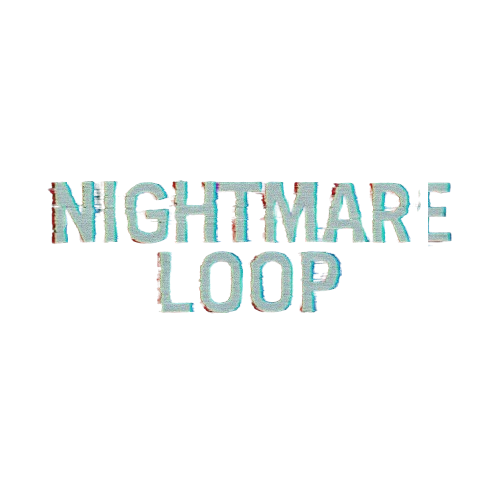

  

# Nightmare Loop
jogo em **godot 4.4** com estética psx/crt, foco em exploração, combate em primeira pessoa e narrativa ligada ao luto e aos estágios da negação. o projeto inclui hub, mapas, sistema de diálogos, hud, efeitos de pós-processamento e gestão de estado por autoloads.
---

## visão geral
| | |
|--|--|
| motor | godot 4.4 (forward plus, `gl_compatibility`) |
| cena inicial | `scenes/ui/splash_screen.tscn` |
| resolução base | 1024×600 (stretch em canvas) |
---

  

## requisitos
- [godot 4.4](https://godotengine.org/download) (editor compatível com o projeto)
- clone deste repositório
---
## como executar
1. abra o godot e use **import** ou **edit project** apontando para a pasta do repositório (`project.godot` na raiz).
2. prima **f5** ou o botão **run** para iniciar pela cena principal configurada no projeto.

não é necessário build separado para desenvolvimento no editor. para exportação (windows, linux, …), configure os templates em **project → export**.
---
## estrutura do repositório (resumo)
| pasta | conteúdo |
|-------|----------|
| `scenes/` | cenas do jogo (ui, níveis, inimigos, efeitos, props) |
| `scripts/` | lógica gdscript (autoloads na raiz de `scripts/` e subpastas por domínio) |
| `assets/` | modelos, texturas, áudio, slides |
| `shaders/` / `materials/` / `environments/` | recursos visuais |
| `tools/` | scripts python auxiliares (manutenção de mapas/colisões) |
| `documentacao/` | notas de implementação e correções |
---
## controles (referência)
definidos em `project.godot` — incluem movimento **wasd**, mira com botão direito do rato, **e** para interagir, **clique esquerdo** / **f** para ataque, **esc** para menu de pausa, **h** para árvore de skills (ação `skill_tree`), teclas **1–5** para atalhos configurados.
---

## licença
este repositório é o projeto **nightmare loop**. ainda não há ficheiro `LICENSE` na raiz; define a licença com a tua equipa antes de distribuir binários ou assets.
---
